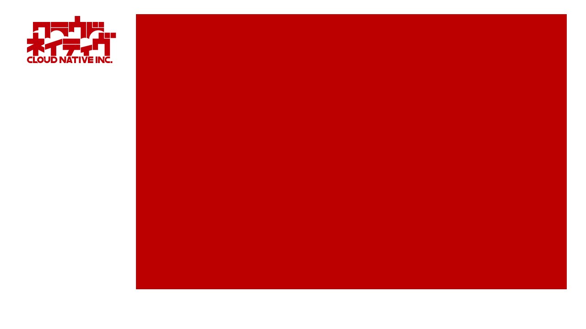

<!-- 
footer: 
-->

株式会社XXXXXXX　御中

プロジェクトプロジェクトプロジェクト キックオフ資料

XXXX/XX/XX

---
<!--
footer: 
backgroundImage: url(images/base.png)
backgroundSize: cover
paginate: true
-->

本日のゴール

* プロジェクトチームのメンバー/役割紹介
* プロジェクトの内容やスコープに関して、共通の認識を形成する
* 背景、状況の確認
    * 現段階でお伺いしたい内容のヒアリング
* プロジェクト進行方法の確認
* Next Actionの確認

---

アジェンダ

 

1. プロジェクト概要
    1. メンバー紹介
    2. 事前情報の整理
    3. プロジェクトのゴールとスコープの確認
2. プロジェクト進行について
    1. スケジュールの確認
    2. 進行方法・ツールの確認
3. CNからの確認事項
    1. お伺いしたいこと
    2. 定例会の日程調整
    3. Next Actionの確認

---

プロジェクト概要

---

2-i メンバー紹介

---

2-ii 事前情報の確認

### **背景**
* 
* 

### **課題**
* 
* 

---

2-iii プロジェクトのゴール・スコープ

## **【ゴール】**
* **ご要件、ご要望を満たす**

## **【スコープ】**
* **システムの選定**
※

* **システムの導入支援（ご要望に応じて）**
※

---

プロジェクト進行について

---

3-i スケジュールの確認

 

* 
記載のスケジュールは、他のお客様の事例を目安に記載しております。実際の進捗はお客様の現場でのご都合に依存することが大きく、==スケジュールを確約するものではございません。==

* 
お客様のご都合によって環境構築のスピード及び、お打ち合わせ頻度に応じて、 月ごとにサービスボリュームを変更いただくことが可能です。</li>
---

3-ii 進行方法・ツールの確認

下記それぞれの用途で弊社が利用しているツールでゲストとして招待させていただきます。
* コミュニケーション：Slack
* ビデオ会議：Zoom
* ファイル共有：Box
* タスク管理：Asana

※その他PJの進行過程で何らかのツールの利用が必要となった場合は都度協議する
marp
---

3-ii 進行方法・ツールの確認

* ZoomのURL
    * 定例会議では、基本的に同じURLを利用します。
    * カレンダーに登録頂くか、ブックマークして頂くことをお勧めします。
* Box上での作業
    * Box上のファイルは、ローカル上にダウンロードせずともOfficeやGoogleWorkSpaceで編集が可能です。
* ゲストアカウントの削除
    * Box・Slack Connectは、PJ終了後も利用可能です。
    * Asanaは、弊社セキュリティポリシーに従い、3ヶ月以上ご利用のないゲストアカウントは確認の上で削除されます。ゲストアカウントは再発行が可能ですので、Slackにてお問い合わせください。

---

当社からの確認事項

---

4-i お伺いしたいこと

---

4-ii 定例会の日程調整

週次でのお打ち合わせの実施を想定しております。
後ほど別途ご連絡いたしますので、ご調整をお願い致します。

---

4-ii 定例会の日程調整

## 様
* 
* 

## クラウドネイティブ
* 
* 

---
<!-- 
footer: 
backgroundImage: url()
-->

<a href="https://cloudnative.co.jp" style="display:block;text-align:center;color:black;text-decoration:underline;
">https://cloudnative.co.jp</a>

ITの世界だからこそ、人と人とのコミュニケーションを最重要視し、
全員が前を向いて楽しく仕事を進められる世界を作るのが最大のミッションです。

株式会社クラウドネイティブ
 Cloud Native Inc.
 設立：2017年5月
 所在地：〒106-0032 東京都港区六本木1-4-5　
 アークヒルズサウスタワー 16F
 代表電話番号：050-1791-0450
 Eメールアドレス：info@cloudnative.co.jp

